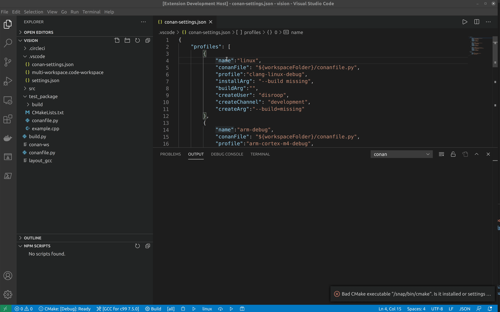

= How To 

This page explains how to install, build and create conan packages and how to install workspaces.

== Packages 

To install, build and create conan packages the profile settings in conan-settings.json file is used. The profile with the corresponding name can be chosen to build, install, or create with the profile picker. 

=== Install and build

To install and build your conan package use the _install_ and _build_ button at the bottom!

image:images/installbuild.gif[Build and install]

=== Create 

To create package use the create button at the bottom!

image:images/create.gif[Create Package]

== Workspaces

Conan workspaces is an experimental feature of conan but great to work with if you work on multiple packages simultaneously. With the https://github.com/microsoft/vscode-cmake-tools[vscode-cmake-tools] from Microsoft and the disroop conan plugin, this is a great setup to work locally. The workspaces settings in conan-settings.json file is used to install conan workspaces.
You can choose the workspace with the corresponding name with the profile picker to install the workspace. 

== Install Workspace

To install a conan workspace use the _install workspace_ button at the bottom!

